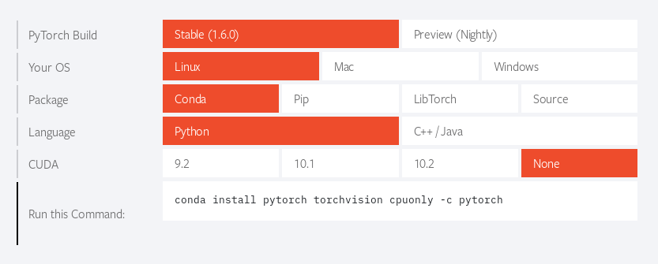
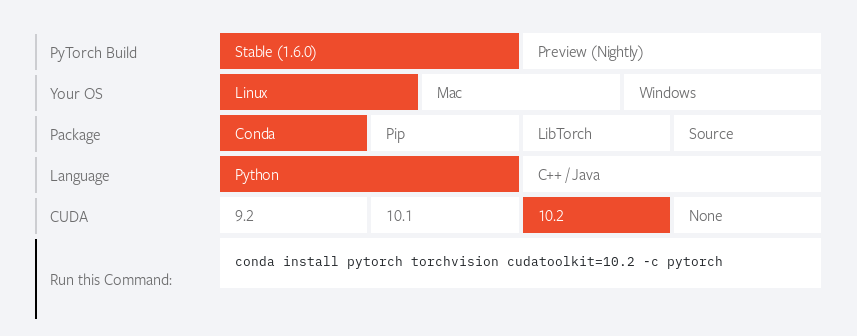
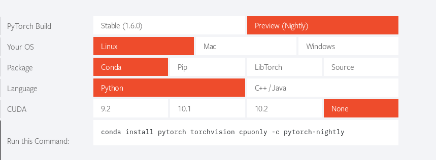
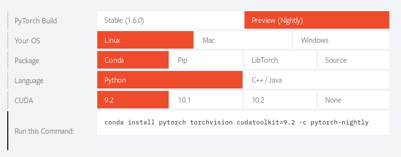
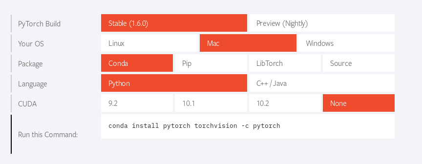
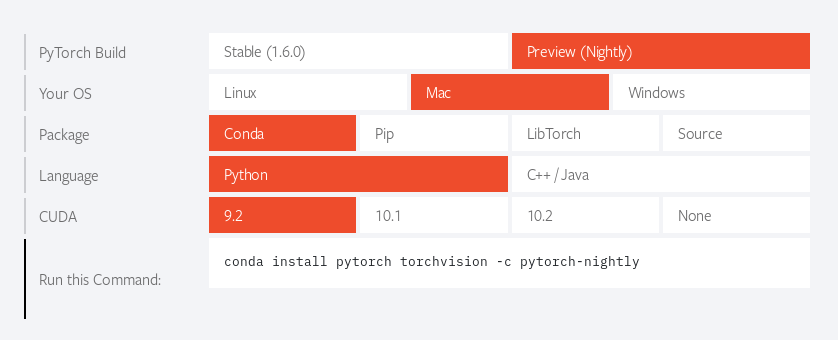
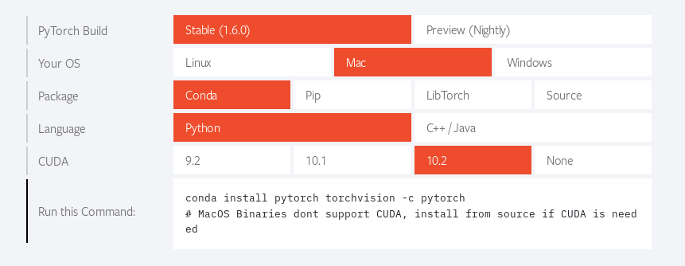

# Install PyTorch from the *conda* console


# Install PyTorch from the *R* console


# PyTorch installation with *conda*

## Linux

### CPU, latest

```
conda install pytorch torchvision cpuonly -c pytorch
```




### GPU cuda 10.2, latest

```
conda install pytorch torchvision cudatoolkit=10.2 -c pytorch
```




### CPU, nightly build

```
conda install pytorch torchvision cpuonly -c pytorch-nightly
```




### GPU cuda 9.2, nightly build

```
conda install pytorch torchvision cudatoolkit=9.2 -c pytorch-nightly
```




## MacOS

### CPU, stable

```
conda install pytorch torchvision -c pytorch
```





### CPU, nightly build

```
conda install pytorch torchvision -c pytorch-nightly
```




### GPU, stable

```
conda install pytorch torchvision -c pytorch
# MacOS Binaries don't support CUDA, install from source if CUDA is needed
```


