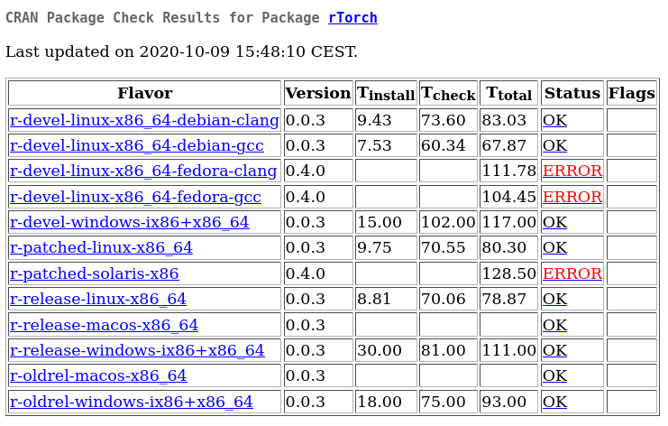

# 0.4.0

## Notes by *Prof Brian Ripley* <ripley@stats.ox.ac.uk>

20201009 3:42 AM (5 hours ago) 
	
to *alfonso.reyes*, CRAN
Dear maintainer,
Please see the problems shown on
<https://cran.r-project.org/web/checks/check_results_rTorch.html>.
Please correct before 2020-10-23 to safely retain your package on CRAN.

###  Flavor: [r-devel-linux-x86_64-fedora-clang](https://www.r-project.org/nosvn/R.check/r-devel-linux-x86_64-fedora-clang/rTorch-00check.html)

    ══ testthat results  ═══════════════════════════════════════════════════════════
    [ OK: 99 | SKIPPED: 38 | WARNINGS: 0 | FAILED: 7 ]
    \1. Error: Python and R share variables (@test_r_torch_share_objects.R#82) 
    \2. Failure: Python string of commands returns a dictionary (@test_types.R#81) 
    \3. Failure: Python string of commands returns a dictionary (@test_types.R#82) 
    \4. Failure: Python string of commands returns a dictionary (@test_types.R#84) 
    \5. Failure: Python string of commands returns a dictionary (@test_types.R#85) 
    \6. Failure: Python string of commands returns a dictionary (@test_types.R#89) 
    \7. Failure: Python string of commands returns a dictionary (@test_types.R#89) 
    
    Error: testthat unit tests failed
    Execution halted 

###  Flavor: [r-devel-linux-x86_64-fedora-gcc](https://www.r-project.org/nosvn/R.check/r-devel-linux-x86_64-fedora-gcc/rTorch-00check.html)

    ══ testthat results  ═══════════════════════════════════════════════════════════
    [ OK: 99 | SKIPPED: 38 | WARNINGS: 0 | FAILED: 7 ]
    \1. Error: Python and R share variables (@test_r_torch_share_objects.R#82) 
    \2. Failure: Python string of commands returns a dictionary (@test_types.R#81) 
    \3. Failure: Python string of commands returns a dictionary (@test_types.R#82) 
    \4. Failure: Python string of commands returns a dictionary (@test_types.R#84) 
    \5. Failure: Python string of commands returns a dictionary (@test_types.R#85) 
    \6. Failure: Python string of commands returns a dictionary (@test_types.R#89) 
    \7. Failure: Python string of commands returns a dictionary (@test_types.R#89) 
    
    Error: testthat unit tests failed
    Execution halted 

###  Flavor: [r-patched-solaris-x86](https://www.r-project.org/nosvn/R.check/r-patched-solaris-x86/rTorch-00check.html)

    ══ testthat results  ═══════════════════════════════════════════════════════════
    [ OK: 48 | SKIPPED: 38 | WARNINGS: 0 | FAILED: 10 ]
    \1.  Error: default (@test-install_rtorch_dryrun.R#7) 
    \2.  Error: 1.2, Python 3.7 (@test-install_rtorch_dryrun.R#19) 
    \3.  Error: 1.2, Python 3.7, Nightly (@test-install_rtorch_dryrun.R#32) 
    \4.  Error: 1.6, Python 3.6, pandas (@test-install_rtorch_dryrun.R#47) 
    \5.  Error: 1.3, Python 3.6, pandas+matplotlib, gpu=9.2 (@test-install_rtorch_dryrun.R#63) 
    \6.  Error: Python and R share variables (@test_r_torch_share_objects.R#45) 
    \7.  Error: Multi-dimensional arrays are handled correctly (@test_types.R#43) 
    \8.  Error: shape of numpy array return in a list (@test_types.R#52) 
    \9.  Error: indices in numpy array have to be integers (@test_types.R#58) 
    \10. Error: Python string of commands returns a dictionary (@test_types.R#71) 
    
    Error: testthat unit tests failed
    Execution halted 

-----

# v0.0.4
20201008: Issues fixed by adding the proper `SystemRequirements`

Notes by ligges@statistik.tu-dortmund.de

On Mon, Oct 5, 2020 at 11:39 PM <ligges@statistik.tu-dortmund.de> wrote:
Dear maintainer,

package rTorch_0.0.4.tar.gz does not pass the incoming checks automatically, please see the following pre-tests:
Windows: <https://win-builder.r-project.org/incoming_pretest/rTorch_0.0.4_20201006_011755/Windows/00check.log>
Status: 2 ERRORs
Debian: <https://win-builder.r-project.org/incoming_pretest/rTorch_0.0.4_20201006_011755/Debian/00check.log>
Status: 1 ERROR

Last released version's CRAN status: OK: 11
See: <https://CRAN.R-project.org/web/checks/check_results_rTorch.html>

CRAN Web: <https://cran.r-project.org/package=rTorch>

Please fix all problems and resubmit a fixed version via the webform.
If you are not sure how to fix the problems shown, please ask for help on the R-package-devel mailing list:
<https://stat.ethz.ch/mailman/listinfo/r-package-devel>
If you are fairly certain the rejection is a false positive, please reply-all to this message and explain.

More details are given in the directory:
<https://win-builder.r-project.org/incoming_pretest/rTorch_0.0.4_20201006_011755/>
The files will be removed after roughly 7 days.

No strong reverse dependencies to be checked.

Best regards,
CRAN teams' auto-check service
Flavor: r-devel-linux-x86_64-debian-gcc, r-devel-windows-ix86+x86_64
Check: CRAN incoming feasibility, Result: Note_to_CRAN_maintainers
  Maintainer: 'Alfonso R. Reyes <alfonso.reyes@oilgainsanalytics.com>'

# v0.0.2
Notes submitted by Martina Schmirl

## single quotes. `DONE!`
Please always write package names, software names and API names in
single quotes in the title and the description field.
f.i.: --> 'Python'

## change dontrun to donttest. `DONE!`
\dontrun{} should be only used if the example really cannot be executed
(e.g. because of missing additional software, missing API keys, ...) by
the user. That's why wrapping examples in \dontrun{} adds the comment
("# Not run:") as a warning for the user.
Please unwrap the examples if they are executable in < 5 sec, or replace
\dontrun{} with \donttest.

## warning messages. `DONE!`
Please check:
Warning messages:
1: In res[i] <- withCallingHandlers(if (tangle) process_tangle(group)
else process_group(group),  :
   number of items to replace is not a multiple of replacement length
2: In res[i] <- withCallingHandlers(if (tangle) process_tangle(group)
else process_group(group),  :
   number of items to replace is not a multiple of replacement length
3: In res[i] <- withCallingHandlers(if (tangle) process_tangle(group)
else process_group(group),  :
   number of items to replace is not a multiple of replacement length
4: In res[i] <- withCallingHandlers(if (tangle) process_tangle(group)
else process_group(group),  :
   number of items to replace is not a multiple of replacement length

## do not use print/cat to write information to the console. `DONE!`
You write information messages to the console that cannot be easily
suppressed. Instead of `print()/cat()` rather use `message()/warning()`  or
`if(verbose)cat(..)` if you really have to write text to the console.

## add \value to .Rd files. `DONE!`
Please add \value to .Rd files and explain the functions results in the
documentation.
